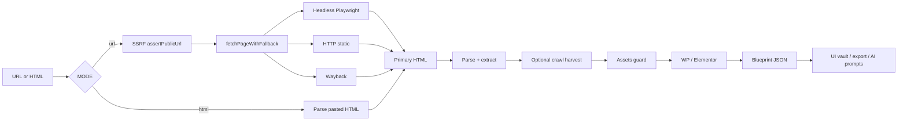
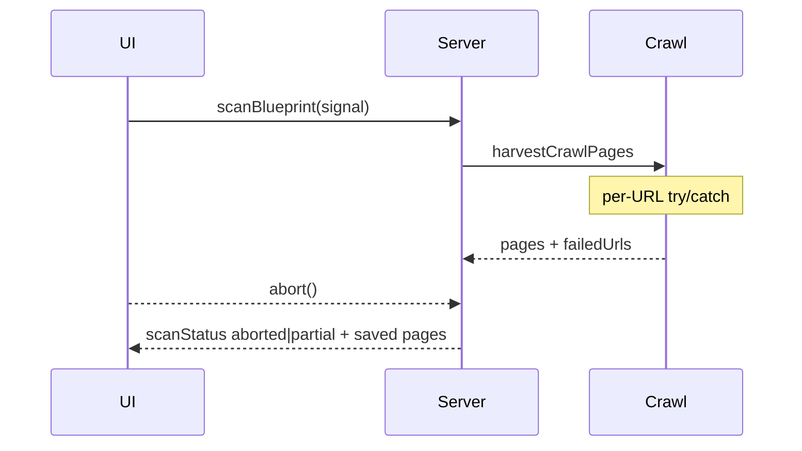

# Architecture

## Purpose

Blueprint Scanner turns a **public** frontend (URL or pasted HTML) into a structured **Blueprint** document: meta, design tokens, DOM outline, tech signals, forms, assets, optional WordPress/Elementor extract — suitable for audit, compare, and AI-assisted UI rebuild.

It is **not** a full-stack clone engine.

## High-level data flow

## Fetch fallback chain

Implemented in `src/lib/scanner/pipeline.ts` as `fetchPageWithFallback`:

| Order | Stage | Module | Notes |
|------:|-------|--------|-------|
| 1 | Headless | `scanner/browser.ts` | If `render: true`; 30s page timeout; force `browser.close()` |
| 2 | HTTP static | `fetch` | 20s timeout; HTML capped at 2.5 MB |
| 3 | Wayback | `blueprint/wayback.ts` | If `wayback: true` and live stages fail |

Partial stage failures append to `partialErrors[]` and **do not** abort the product pipeline.

## Core modules

| Path | Role |
|------|------|
| `lib/blueprint/scan.ts` | Orchestrator `scanToBlueprint` |
| `lib/blueprint/server.ts` | TanStack server fns + Zod validation + API guard |
| `lib/scanner/pipeline.ts` | Graceful degradation fetch chain |
| `lib/scanner/browser.ts` | Playwright shield, hard timeouts, abort |
| `lib/scanner/assets.ts` | Size budgets, safe JSON stringify |
| `lib/scanner/errors.ts` | `withApiGuard`, `toApiError`, process guards |
| `lib/blueprint/crawl-pages.ts` | Multi-page harvest + partial recovery |
| `lib/blueprint/retry.ts` | Transient HTTP/error backoff |
| `lib/blueprint/detect-tech.ts` | Stack heuristics |
| `lib/blueprint/design-system.ts` | Colors, fonts, Elementor globals, typography |
| `lib/blueprint/thin-html.ts` | SPA/empty-shell detection |
| `lib/blueprint/meta-urls.ts` | Absolute OG/Twitter URLs |
| `lib/blueprint/capture-assets.ts` | Asset download with warnings |
| `lib/blueprint/wordpress-jetengine.ts` | WP REST / Jet listing extract |
| `lib/blueprint/elementor-compiler.ts` | Elementor template JSON v0.4 |
| `lib/blueprint/storage.ts` | Browser localStorage vault + exports |
| `lib/blueprint/db-store.ts` | Optional PGLite persistence |
| `lib/blueprint/compare.ts` | Blueprint diff |
| `lib/ai-rebuild/prompter.ts` | AI Rebuild prompt + Tailwind fragment |
| `lib/ai-rebuild/architecture-compiler.ts` | SPA-aware architecture prompt |
| `lib/seo/json-ld.ts` | Structured data helpers |

## Blueprint schema (overview)

Full TypeScript types: `src/lib/blueprint/types.ts`.

| Field | Meaning |
|-------|---------|
| `id`, `version`, `createdAt` | Identity (`1.0.0` \| `1.1.0` \| `1.2.0`) |
| `source` | `url` \| `html` \| `wayback` |
| `sourceUrl` / `finalUrl` / `statusCode` | Origin metadata |
| `meta` | title, description, OG, Twitter, icons, viewport |
| `tech[]` | name + confidence + evidence |
| `design` | colors, fonts, cssVariables, Elementor globals, typography |
| `assets[]` | url, type, optional base64/path when captured |
| `links[]`, `forms[]`, `headings[]`, `outline` | Structure |
| `html`, `cssBundles[]` | Primary snapshot (HTML may be truncated) |
| `pages[]` | Additional crawl pages (title, hash, counts) |
| `options` | Applied `maxPages`, `render`, `wayback`, `captureAssets`, `wpJetEngine` |
| `wordpress` | WP architecture extract or `null` |
| `elementorTemplate` | Importable Elementor JSON or `null` |
| `scanStatus` | `complete` \| `partial` \| `aborted` |
| `partialStats` | `{ totalAttempted, succeeded, failed }` |
| `scanWarnings.failedUrls[]` | Per-URL crawl failures |
| `isThinHtml` / `thinHtmlReasons[]` | SPA/empty shell flag |
| `partialErrors[]` | Non-fatal stage failures |
| `stats` | bytes, counts, `scanMs` |
| `notes[]`, `limitations[]` | Human-readable caveats |

## Partial scan & cancel

- Per-URL isolation in crawl: one 500/timeout does not kill the job.
- User **Zrušiť** aborts via `AbortSignal`; harvested pages still return when possible.
- UI shows partial badge + failed URL list when `scanStatus !== "complete"`.

## Security boundaries (summary)

| Control | Implementation |
|---------|----------------|
| SSRF | `assertPublicUrl` — block localhost, RFC1918, link-local, `.local`/`.internal`, metadata hosts |
| Protocols | `http:` / `https:` only |
| HTML size | 2.5 MB cap |
| Assets | 10 MB each · 50 MB total · max 40 files |
| Browser | try/finally close · 30s page · 15s launch |
| API | `withApiGuard` · structured `{ ok: false, error, code }` |
| Process | `unhandledRejection` / `uncaughtException` log-only guards |

Details: [SECURITY.md](./SECURITY.md).

## UI shell

| Screen | Component | Behavior |
|--------|-----------|----------|
| Scan | `routes/index.tsx` + `ScanForm` (compact) | 100dvh centered · neon input · icon toggles |
| Result | `BlueprintView` | Tabs, exports, AI prompts · 100dvh scroll |
| Overlays | History / Compare / Import | Modal, not sidebar |

Design tokens: dark canvas `#0A0A0B`, surface `#111113`, accent `#C8A16E` (`src/styles.css`).
